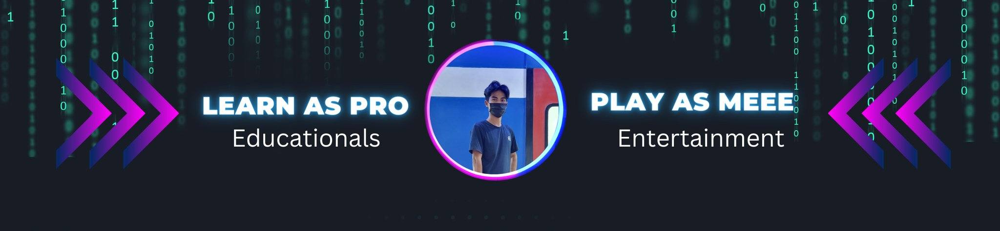
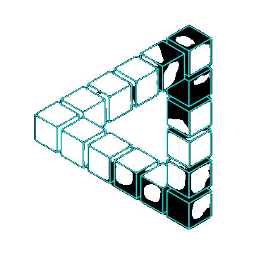

<h1 align="center">
  Hi 👋, I'm Soy Vitou Pro
  

  <table align="center">
    <tr border: none;>
      <td></td>
      <td></td>
    </tr>
</table>
</h1>

<h3 align="center">🚀 Passionate AI & ML Engineer | Transforming Ideas into Intelligent Solutions</h3>

- 🔭 I’m currently working on Machine Learning ( Image Processing )

- 🌱 I’m currently learning **Python, Pytorch, Tensorflow, JavaScript, React, etc...**

- 👯 I’m looking to collaborate on **Machine Learning**

- 💬 Ask me about **Python, Unity**

- 📫 How to reach me **Soy vitou Pro**

- ⚡ Fun fact **I think I am funny**

 

# 

<h3 align="left">Connect with me:</h3>

 

#

<h1 align=left>🚀 Key Achievements:</h1>
<h2><a href="https://www.researchgate.net/publication/376751387_Animal_Classification_using_Convolutional_Neural_Network">🏆 Best Award-Paper </a> </h2>

Recognized by CADT 2th student conference digital technology ( SCDT ), topic is research about Animal Classification using Convolutional Neural Network. We focus on which algorithm is the best one for animal classification using CNN

<h2><a href="https://www.researchgate.net/publication/376751358_Animal_Classification_using_Hybrid_Model">🥈 Top-2 Engineering Day Year2 Competition </a></h2> 

Competition in RUPP, FE, 10 year Anniversary we have have selected and presentation about hybrid model is CNN + XGBOOST for animal classification 

<h2><a href="https://sic.edc.org/"> 🐍 Certificate Python from SIC </a> </h2>

 For 4 Months I was completed Basic Python and get certificate from SIC ( Samsung Innovation Campus )  

<h2><a href="https://sic.edc.org/">🎓 Graduate Big Data from SIC  </a> </h2>

 For 1 Year I was completed Big Data course and get certificate from SIC ( Samsung Innovation Campus ). The final project is Traffic Analysis 

<h2><a href="https://www.facebook.com/UniversityIndustryCooperationCenter">🌱 Participated Busines StartUp of UICC  </a></h2>

 We have spend time for 5 months to create a busines model of Tourism in Cambodia and make a presentation of our ideas 

 

<h1 align=left>🚀 Bachelor's degree activities:</h1>
<h2><a href="https://www.facebook.com/UniversityIndustryCooperationCenter">🌱 Teacher assistant </a></h2>

 I worked as teacher assistant and advise to student around 30 teams for complete their project and I am a evaulator on their project also we do the presentation and evaulation based on the criteria we setted.  

<h2><a href="https://www.facebook.com/UniversityIndustryCooperationCenter">🌱 Mentoring at Heineken Sustainathon  </a></h2>

 this involves student for build their innovative ideas as the prototype for competitive  

<h2><a href="https://www.facebook.com/UniversityIndustryCooperationCenter">📝 Interviewer in C4C offered by USAID  </a></h2>

 we are interviewing for recruitment cloud for Cambodia 

<h2><a href="https://web.facebook.com/gameclubferupp">🤵‍♂️ Founder of game club  </a></h2>

 I am a founder of Game Club with Koungmeng and still operate it for a year, we have a lot of activites such as game jam, game development, game competition, Casual games etc ...  

<h2><a href="">👷‍♂️ Internship As Graphic Designer in Y1S1</a></h2>

 During my internship as a graphic designer, I had the opportunity to immerse myself in the real world situation, real world problem. Working closely with a team of experienced like Bong Neak Sokkim. This is the time that I has contributed creative ideas and collaborated with senior designer and developer. 

<h2><a href="">😶‍🌫️ Participated in Data Analytic BootCamp Y2S1 </a></h2>

 I have learnt about Mathematics, statistics, programming python, excel, data visualize, database management, business and industry knowledge, and we learnt all this thing in one week

<h1 align=left><b>🚀 Bachelor's degree project:</b></h1>
<h2><a href="https://www.researchgate.net/publication/376751387_Animal_Classification_using_Convolutional_Neural_Network">🌱 7-Segment Display in Y1S1  </a></h2>

 It's a type of electronic display device that can show numerals and some basic characters by illuminating specific segments we are using $\color{yellow}{proteus}$. It consists of seven individual segments arranged in the shape of the number $\color{yellow}{"8."}$ Each segment can be independently controlled to display different numbers or characters. 

<h2><a href="">🌱 Liquid Crystal Display ( LCD ) in Y1S1 </a></h2>

 I has been learnt how to controlled an LCD by using an Arduino with C++, First I gather the necessary components ( Arduino board, LCD 16 x 2, Jumper wires and Potentiometer [For adjusting contrast] ). The second I'm using jumper wires connect to corresponding pin and combination potentiometer for adjust lighting of LCD. The last one is upload the code to the Arduino by using C++. 

<h2><a href="">🌱 Map 2D System of RUPP using Unity Y1S2</a></h2>

 I'm using Unity engine for create a feature of mapping system to show directions and show a basic information of RUPP and display image has capture by our team in those time.

<h2><a href="">🌱 Kid Game in Scratch engine Y1S2 </a></h2>

 Scratch is a game engine or application that can be created kids game. create a game where the player controls a character. They have sprite, background player movement, falling objects, object movement, collision detection, broadcast message, game loop, and so on. I has created a game also called HARDESTGAME. It's consists 10 levels of this game.

<h2><a href="">🌱 Baccarat Java Program in Y2S1 </a></h2>

 Baccarat is a popular card game played at casinos, I implemented in java as a console-based game. This game have a card representation, Deck of cards, Game logic, Player interaction with computer, error handling and last one is game flow.

<h2><a href="">🌱 Real-time Chat App in Y2S1</a></h2>

 In this project I'm using $\color{yellow}{NodeJs}$ and $\color{yellow}{ExpressJs}$ as $\color{yellow}{Backend}$ for broadcast message and deploy this application with share hosting $\color{yellow}{Render.com}$. 

<h2><a href="">🌱 Calculator Using JavaFX in Y2S2 </a></h2>

 I have implemented simple calculator using JavaFX, UI generated by SceneBuilder application and using java to implemented some stuff of logic that representation of calculator operation. 

<h2><a href="https://www.researchgate.net/publication/376751387_Animal_Classification_using_Convolutional_Neural_Network">🌱 Animal classification using Hybrid model in Y2S2 </a></h2>

 it's our first research of image processing by combination of $\color{yellow}{CNN}$ ( $\color{yellow}{VGG16}$ ) and $\color{yellow}{XGBoost}$ 

<h2><a href="">🌱 Abusive classification using Hybrid model in Y2S2 </a></h2>

 In this research we adjust a little bit of $\color{yellow}{Architecture}$ and the main thing in this research is about $\color{yellow}{Dataset}$, we try to figure out of abusive image 

<h2><a href="">🌱 E-Learning Website ( VM ) ⚒️ in Y3S1</a></h2>

 we have build a website that's seem like E-learning platform the process is everyone can be a teacher or a student and if you are a teacher you will have the feature like copy link from youtube and make as your playlist and it's seem like social media you can follow each other 

<h2><a href="">🌱 Traffic Streaming Analysis in Y3S1 </a></h2>

 In this project we working on $\color{yellow}{Big}$ $\color{yellow}{Data}$ project mostly we focus on flow of data such as handle $\color{yellow}{real-time}$ $\color{yellow}{streaming}$ we are using $\color{yellow}{Hadoop}$ for store data and we are using $\color{yellow}{NiFi}$ for ingestion data from local storage to $\color{yellow}{HDFS}$ and we are using $\color{yellow}{Kafka}$ for streaming analysis also, and we are involved data transformation, data processing, data visualization by using $\color{yellow}{PowerBI}$ and etc ...

<h2><a href="">🌱 Attendance Tracking system using Facial recognition methodology Y3S2</a></h2>

 In this website and system we are using $\color{yellow}{laravel}$ for $\color{yellow}{full}$ $\color{yellow}{stack}$ and we deploy it by using $\color{yellow}{docker}$, and for attendance tracking we are using $\color{yellow}{face}$ $\color{yellow}{recognition}$  by using python and apply it in $\color{yellow}{raspberrypi}$   for recording attendance  

<h3>Open source projects</h3>
<table>
  <thead align="center">
    <tr border: none;>
      <td><b>🎁 Projects</b></td>
      <td><b>⭐ Stars</b></td>
      <td><b>📚 Forks</b></td>
      <td><b>🛎 Issues</b></td>
      <td><b>📬 Pull requests</b></td>
      <td><b>🛠 Commits</b></td>
    </tr>
  </thead>
  <tbody>
    <tr>
      <td style="white-space: nowrap; max-width: 300px;"><a href="https://github.com/SoyVitou2019/Online-Learning-Platform" ><b>Online&nbsp;Learning&nbsp;Platform</b></a></td>
      <td></td>
      <td></td>
      <td></td>
      <td></td>
      <td></td>
    </tr>
    <tr>
      <td style="white-space: nowrap; max-width: 300px;"><a href="https://github.com/SoyVitou2019/ML_Tkinter_UI"><b>UI&nbsp;Image&nbsp;Classification&nbsp;Using&nbsp;Tkinter</b></a></td>
      <td></td>
      <td></td>
      <td></td>
      <td></td>
      <td></td>
    </tr>
  </tbody>
</table>

<h2 align="left">Languages and Tools:</h2>
  
  
  
  
  
  
  
  
 

### 📊 Stats and Contributions

  
  

 

 

#

